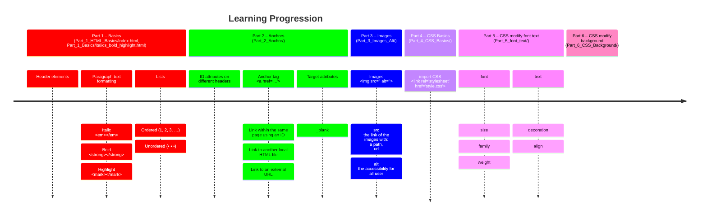

*This project has been created by Florent Cretin.*
<!-- 𝔸 𝔹 ℂ 𝔻 𝔼 𝔽 𝔾 ℍ 𝔾 𝕁 𝕂 𝕃 𝕄 ℕ 𝕆 ℙ ℚ ℝ 𝕊 𝕋 𝕌 𝕍 𝕎 𝕏 𝕐 ℤ -->
<!-- 🗎 🖋 👀 🗣 🕑 -->
[tagMarkdown]: https://github.com/Lzozoflo/Markdown

[tagMozillahtml]: https://developer.mozilla.org/fr/docs/Web/HTML
[tagMozillacss]: https://developer.mozilla.org/fr/docs/Web/CSS
[tagW3schools]: https://www.w3schools.com/html/default.asp
# HTML CSS

### [📘 Cours HTML & CSS](https://openclassrooms.com/fr/courses/1603881-creez-votre-site-web-avec-html5-et-css3)

- #### [📘 Cours bonus pour faire des animation css (grosse envie de comprendre comment ca fonctionne)](https://openclassrooms.com/fr/courses/5919246-creez-des-animations-css-modernes)
- #### [📘 Cours bonus pour l'accessibilité des site web (pas fait mais a faire)](https://openclassrooms.com/fr/courses/6691451-codez-un-site-web-accessible-avec-html-css/6964630-creez-un-contenu-solide-et-accessible#/id/r-6939939)

<h2 id="summary">🗓 𝕊ummary</h2>

- [𝔻escription](#description)
- [𝕆bjectives](#objectives)
- [🕑 𝕃earning ℙrogression](#learningprogression)
- [🛠  ℝequirements](#requirements)
- [𝕌sage](#objectives)
- [𝕃earning Notes](#learning-notes)
- [ ℝesources](#resources)
- [🖋 𝔸uthor](#author)

<h2 id="description">𝔻escription</h2>

suivi d'un petit cours openclassroom sur html
pour but de fare ensuite leur cours javascript avec leur base donne dans ce cours ci

 

- [🗓 𝕊ummary](#summary)

 

---

 

<h2 id="objectives">𝕆bjectives</h2>

javais quelque connaissance basic en html CSS avant ce cours je l'ai fait dans le but de remettre le nez dans l´html simplement avec un cours "reconnue"

revoir des base comme comment mettre du texte en italic en gras voir surligne ce que je ne connaisais pas
les list ordonner, non ordonner
hypelink qui redirige faire un id ou vers des lien extern 
img, alt
et bien d'autre ... 

et au passage faire mon 1er projec avec un essaie de documentation [Markdown][tagMarkdown] sourcer touver ma facon de faire des readme ma typo mon visuel... 

 

- [🗓 𝕊ummary](#summary)

 

---

 

<h2 id="learningprogression">🕑 𝕃earning ℙrogression</h2>

 

- [🗓 𝕊ummary](#summary)

 

---

 

<h2 id="requirements">🛠 ℝequirements</h2>

- un nagigateur pour afficher la 'NAMEFILE.html'
- aucune base en html besoin pour suivre le cours
 

- [🗓 𝕊ummary](#summary)

 

---

 

<h2 id="resources">ℝesources</h2>

- [W3schools doc/tutorial HTML][tagW3schools]
- [Mozilla documentation HTML][tagMozillahtml]
- [Mozilla documentation CSS][tagMozillacss]
 

- [🗓 𝕊ummary](#summary)

 

---

 

<h2 id="author">🖋 𝔸uthor</h2>

All implementation decisions and documentation were written and validated by the project author.

 

- [🗓 𝕊ummary](#summary)
