```mermaid
---
config:
  logLevel: debug
  theme: default
  themeVariables:
    cScale0: "#ff0000"
    cScaleLabel0: "#ffffff"
    cScale1: "#00ff00"
    cScale2: "#0000ff"
    cScaleLabel2: "#ffffff"
---
timeline
    title Learning Progression

    section Part 1 – Basics<br>(Part_1_Basics/index1.html,<br>Part_1_Basics/italics_bold_highlight.html)
    Header elements
    Paragraph text formatting:
        Italic<br><em></em>: Bold<br><strong></strong>: Highlight<br><mark></mark>
    Lists:
        Ordered (1, 2, 3, …): Unordered (• • •)

    section Part 2 – Anchors<br>(Part_2_Anchor/index2.html)
      ID attributes on different headers
      Anchor tag<br><a href="...">: Link within the same page using an ID: Link to another local HTML file: Link to an external URL

```

*This project has been created by Florent Cretin.*
<!-- 𝔸 𝔹 ℂ 𝔻 𝔼 𝔽 𝔾 ℍ 𝔾 𝕁 𝕂 𝕃 𝕄 ℕ 𝕆 ℙ ℚ ℝ 𝕊 𝕋 𝕌 𝕍 𝕎 𝕏 𝕐 ℤ -->
<!-- 🗎 🖋 👀 🗣 🕑 -->

[tagMozillahtml]: https://developer.mozilla.org/fr/docs/Web/HTML
[tagMozillacss]: https://developer.mozilla.org/fr/docs/Web/CSS

# HTML CSS

### [📘 Cours HTML & CSS](https://openclassrooms.com/fr/courses/1603881-creez-votre-site-web-avec-html5-et-css3)

## 🗓 𝕊ummary

- [Description](#description)
- [Objectives](#objectives)
- [🕑 𝕃earning ℙrogression](#learningprogression)
- [🛠 Requirements](#requirements)
- [Usage](#objectives)
- [Learning Notes](#learning-notes)
- [Resources](#resources)
- [🖋 Author](#author)

<h2 id="description">𝔻escription</h2>

 

---

 

<h2 id="objectives">𝕆bjectives</h2>

 

---

 

<h2 id="learningprogression">🕑 𝕃earning ℙrogression</h2>

 

---

 

<h2 id="requirements">🛠 ℝequirements</h2>

 

---

 

<h2 id="resources">ℝesources</h2>

- [Mozilla documentation HTML][tagMozillahtml]
- [Mozilla documentation CSS][tagMozillacss]
- 

 

---

 

<h2 id="author">🖋 𝔸uthor</h2>

All implementation decisions and documentation were written and validated by the project author.